# 서비스 어드바이저 최소 권한 가이드

## 개요
서비스 어드바이저 전체 기능을 사용하기 위해 필요한 최소 권한을 정리했습니다. 모든 권한은 읽기 전용으로 제한되어 있어 AWS 리소스에 대한 안전한 분석만 수행합니다.

## IAM 역할 생성 방법

### 1단계: 권한 정책 먼저 생성

1. **AWS Management Console**에 로그인
2. **IAM 서비스**로 이동
3. 왼쪽 메뉴에서 **"정책(Policies)"** 클릭
4. **"정책 생성"** 버튼 클릭

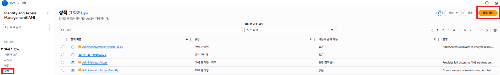

### 2단계: 정책 권한 설정

1. **"JSON"** 탭 클릭
2. 아래 정책을 복사하여 붙여넣기:

```json
{
    "Version": "2012-10-17",
    "Statement": [
        {
            "Sid": "ServiceAdvisorReadOnlyPermissions",
            "Effect": "Allow",
            "Action": [
                "ec2:Describe*",
                "rds:Describe*",
                "rds:List*",
                "lambda:List*",
                "lambda:Get*",
                "iam:List*",
                "iam:Get*",
                "iam:GenerateCredentialReport",
                "s3:List*",
                "s3:Get*",
                "cloudwatch:Get*"
            ],
            "Resource": "*"
        }
    ]
}
```

3. **"다음: 태그"** 클릭

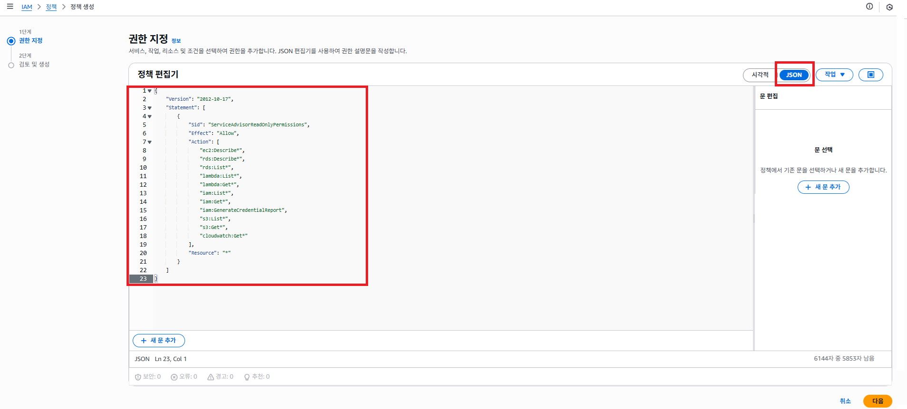

### 3단계: 정책 이름 및 생성

1. 태그는 선택사항이므로 **"다음: 검토"** 클릭
2. 정책 이름 입력: **"console-check-policy"**
3. 설명 입력: **"서비스 어드바이저를 위한 읽기 전용 권한"**
4. **"정책 생성"** 클릭

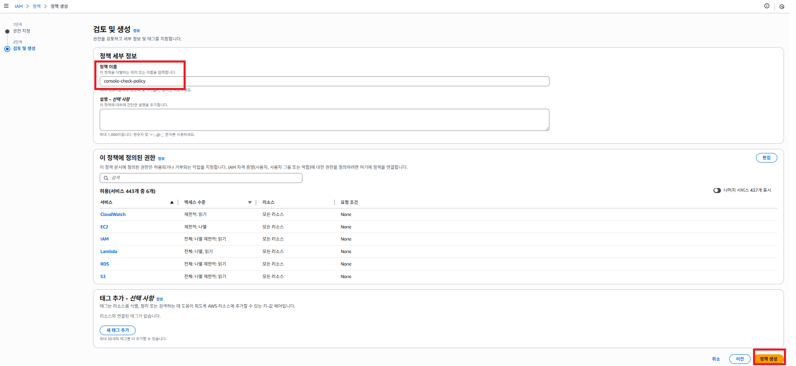

### 4단계: IAM 역할 생성

1. 왼쪽 메뉴에서 **"역할(Roles)"** 클릭
2. **"역할 만들기"** 버튼 클릭

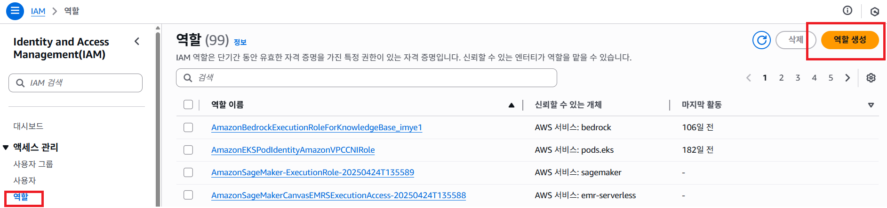

### 5단계: 신뢰할 수 있는 엔터티 선택

1. **"AWS 계정"** 선택
2. **"다른 계정"** 선택
3. 계정 ID 입력: **713881821833**
4. **"외부 ID 필요"** 체크박스는 선택하지 않음
5. **"다음"** 클릭

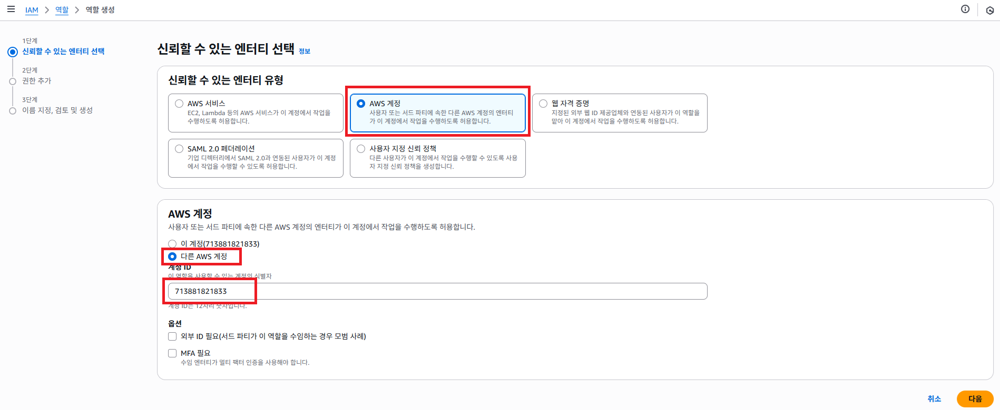

### 6단계: 생성한 정책 연결

1. 검색창에 **"console-check-policy"** 입력
2. 앞서 생성한 정책 선택
3. **"다음"** 클릭

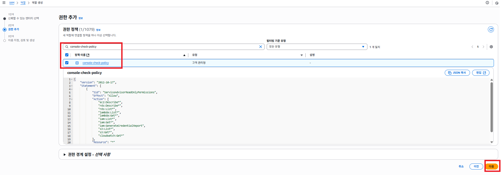

### 7단계: 역할 이름 및 생성

1. 역할 이름 입력: **"console-check-role"**
2. 설명 입력: **"서비스 어드바이저를 위한 읽기 전용 역할"**
3. 신뢰할 수 있는 엔터티와 권한 정책 확인
4. **"역할 만들기"** 클릭

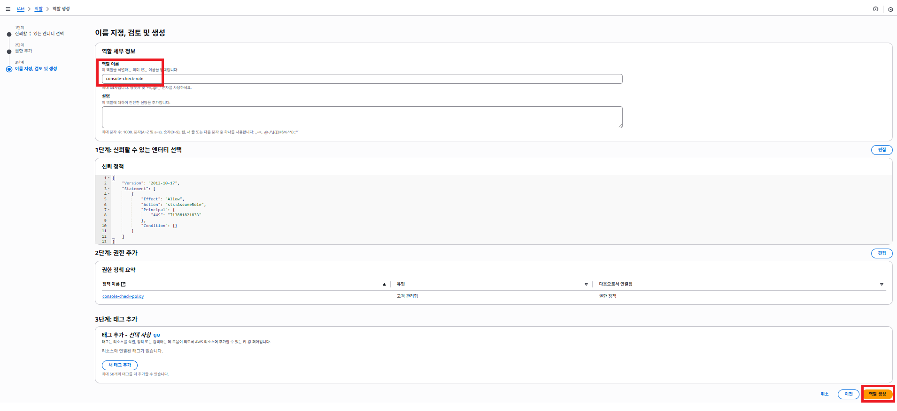

### 8단계: 역할 ARN 복사

1. 생성된 역할 클릭
2. **역할 ARN** 복사 (예: `arn:aws:iam::123456789012:role/console-check-role`)
3. 이 ARN을 서비스 어드바이저에서 사용

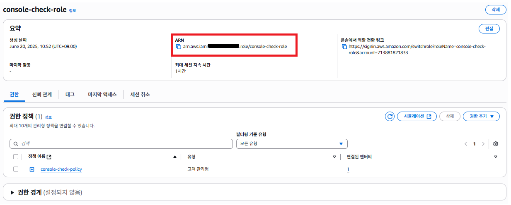

### 9단계: 회원가입 하기
1. 회원가입 클릭
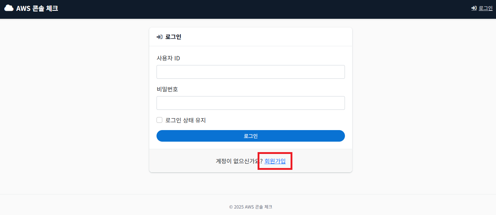
2. 사용자 ID와 비밀번호 입력
3. 8단계에서 복사한 **역할 ARN** (예: `arn:aws:iam::123456789012:role/console-check-role`) 입력
4. 회원가입 클릭
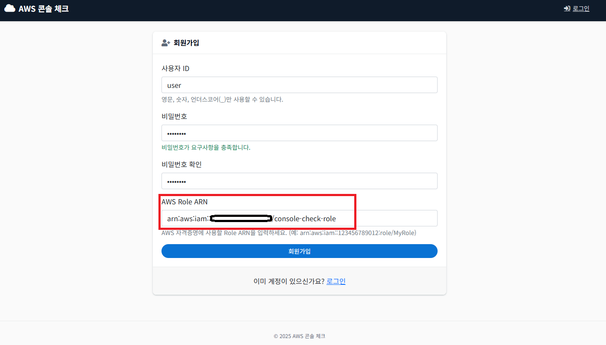

### 10단계: 서비스 이용
1. 사용자 ID와 비밀번호 입력
2. 로그인
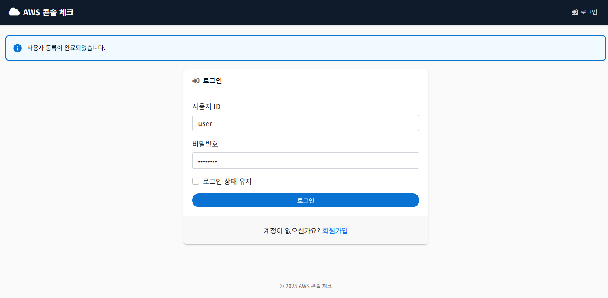


## 권한별 안전성 분석

### 1. EC2 권한
- **`ec2:Describe*`**: EC2 리소스 정보만 조회 (인스턴스, 보안그룹, 볼륨, EIP 등)
  - ✅ **안전**: 읽기 전용, 리소스 생성/수정/삭제 불가
  - ✅ **용도**: 보안 설정, 백업 상태, 인스턴스 최적화 분석

### 2. RDS 권한
- **`rds:Describe*`**: RDS 인스턴스 설정 정보 조회
- **`rds:List*`**: RDS 리소스 목록 및 태그 조회
  - ✅ **안전**: 읽기 전용, 데이터베이스 설정 변경 불가
  - ✅ **용도**: 백업, 암호화, Multi-AZ, 인스턴스 크기 분석

### 3. Lambda 권한
- **`lambda:List*`**: Lambda 함수 목록 및 기본 설정 조회
- **`lambda:Get*`**: Lambda 함수 상세 설정 조회
  - ✅ **안전**: 읽기 전용, 함수 코드나 설정 변경 불가
  - ✅ **용도**: 메모리, 타임아웃, 런타임, 권한 분석

### 4. IAM 권한
- **`iam:List*`**: IAM 리소스 목록 조회 (사용자, 정책, 그룹, 역할)
- **`iam:Get*`**: IAM 리소스 상세 정보 조회 (정책 문서, 계정 설정)
- **`iam:GenerateCredentialReport`**: 자격 증명 보고서 생성
  - ✅ **안전**: 읽기 전용, 사용자나 정책 생성/수정/삭제 불가
  - ✅ **용도**: 액세스 키 교체, MFA 설정, 비활성 사용자 분석
  - ✅ **무료**: `GenerateCredentialReport`는 비용이 발생하지 않는 무료 기능
  - ⚠️ **참고**: 실제 리소스가 아닌 분석용 보고서만 생성

### 5. S3 권한 (향후 확장용)
- **`s3:List*`**: S3 버킷 목록 및 기본 정보 조회
- **`s3:Get*`**: S3 버킷 설정 정보 조회
  - ✅ **안전**: 읽기 전용, 버킷이나 객체 생성/수정/삭제 불가
  - ✅ **용도**: 암호화, 공개 액세스, 버전 관리 분석

### 6. CloudWatch 권한
- **`cloudwatch:Get*`**: CloudWatch 메트릭 데이터 조회
  - ✅ **안전**: 읽기 전용, 메트릭이나 알람 생성/수정/삭제 불가
  - ✅ **용도**: CPU, 메모리 사용률 등 성능 데이터 분석

## 보안 특징

### ✅ 완전한 읽기 전용
- **생성 권한 없음**: Create, Put, Post 등 생성 권한 제외
- **수정 권한 없음**: Update, Modify, Change 등 수정 권한 제외
- **삭제 권한 없음**: Delete, Remove, Terminate 등 삭제 권한 제외

### ✅ 데이터 보호
- **민감 데이터 접근 불가**: 실제 데이터나 파일 내용 접근 불가
- **설정 정보만 조회**: 리소스 구성 및 메타데이터만 분석
- **로그 데이터 접근 불가**: 애플리케이션 로그나 사용자 데이터 접근 불가

### ✅ 최소 권한 원칙
- **필요한 권한만**: 서비스 어드바이저 기능에 필요한 최소한의 권한
- **와일드카드 제한**: 읽기 전용 작업에만 와일드카드 사용
- **리소스 범위**: 필요시 특정 리소스로 제한 가능
